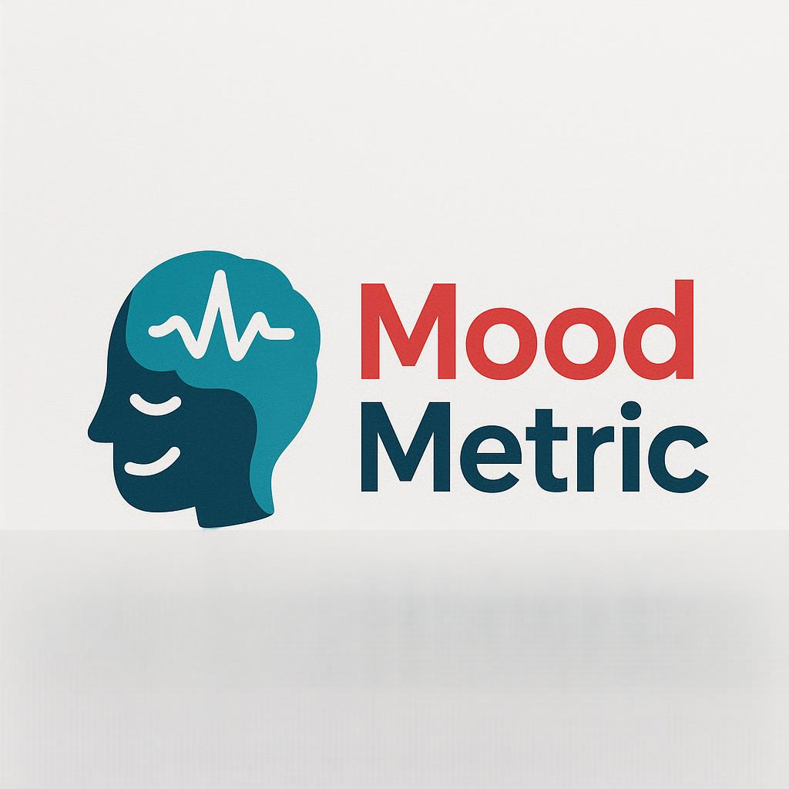

# Projet : 🧠 Détection du Stress - Application Web avec Streamlit

  

# MoodMetric - WebApp de Prédiction de Stress 🌡️🧠

Bienvenue dans **MoodMetric**, une application web interactive développée avec **Streamlit**, conçue pour évaluer automatiquement votre **niveau de stress**  à partir de vos habitudes de vie.

Ce projet a été réalisé dans le cadre d’un travail académique visant à concevoir une application capable de prédire le niveau de stress d’un individu en utilisant un modèle de **machine learning (Random Forest)**. Grâce à une interface simple et intuitive, l’utilisateur peut renseigner différentes informations liées à son mode de vie. L’application analyse ensuite ces données pour déterminer si le **niveau de stress faible**, **moyen** ou **élevé**.

L’objectif principal de ce projet était de se familiariser avec les bases du développement d’interfaces interactives via Streamlit, tout en appliquant des concepts fondamentaux du machine learning pour construire une application web fonctionnelle, accessible et utile.

---

## 🎯 Objectif du Projet

Ce projet a été réalisé dans le cadre du DU Data Analytics de l’Université Paris 1. L’objectif principal est de développer une application web en Python capable de :

- Recevoir des **entrées utilisateur** via une interface simple (sliders, menus déroulants).
- Utiliser un modèle de **machine learning** entraîné pour **prédire le niveau de stress**.
- **Afficher les résultats** de manière intuitive et pédagogique.
- **Sensibiliser** les utilisateurs à l'importance de la gestion du stress.

---

## 📁 Données Utilisées

Le jeu de données utilisé provient d’une source ouverte sur kaggle et porte sur des auto-évaluations de stress basées sur divers **facteurs de style de vie** :

- Durée de sommeil
- Activité physique
- Temps d'écran
- Consommation de caféine et d'alcool
- Habitudes de tabagisme
- Pratique de la méditation
- Heures de travail, interactions sociales, etc.

Les colonnes non pertinentes ou redondantes ont été supprimées afin de se concentrer sur les variables les plus significatives pour la prédiction, les variables retenues sont celles citées ci-dessus.

---

## 🧠 Modèle de Machine Learning

Le modèle utilisé est un **Random Forest Classifier** de `scikit-learn`. Voici les étapes clés :

- Nettoyage et préparation des données
- Encodage des variables binaires (`Yes/No` → `1/0`)
- Séparation des données en `X` (features) et `y` (label)
- Split des données en jeu d'entraînement et de test
- Entraînement du modèle
- Sauvegarde du modèle sous format `.pkl` via `pickle`

📄 Fichier concerné : `trainn_model.py`

---

## 🖥️ Fonctionnement de l'Application

L'application a été construite avec **Streamlit** dans le fichier `application.py`. Elle comporte trois sections principales :

### 🔹 Accueil

- Interface utilisateur intuitive avec sliders et menus déroulants.
- Bouton “Analyser mon stress” déclenchant la prédiction.
- Affichage clair du niveau de stress (`Faible`, `Modéré`, `Élevé`) avec messages personnalisés.

### 🔹 À propos

- Explications sur le fonctionnement de l'application et du modèle.
- Conseils personnalisés selon le niveau de stress prédit.

### 🔹 Contact

- Présentation des membres de l'équipe projet.
- Coordonnées fictives pour contact.

---

## 🛠️ Technologies Utilisées

- **Python 3**
- **Streamlit**
- **Scikit-learn**
- **Pandas**
- **Pickle**

